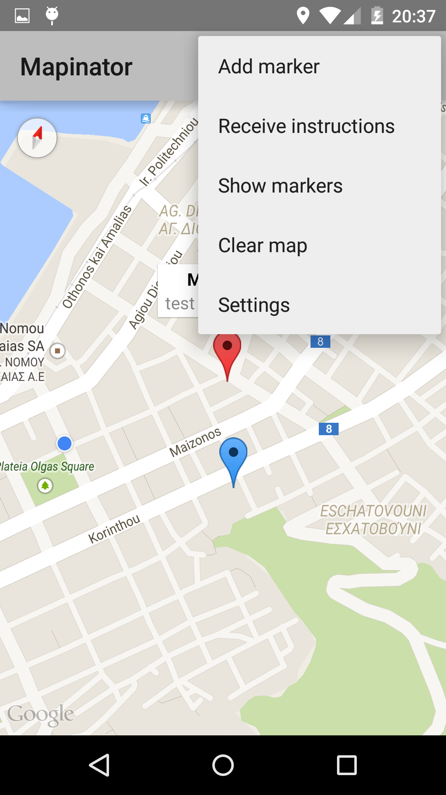
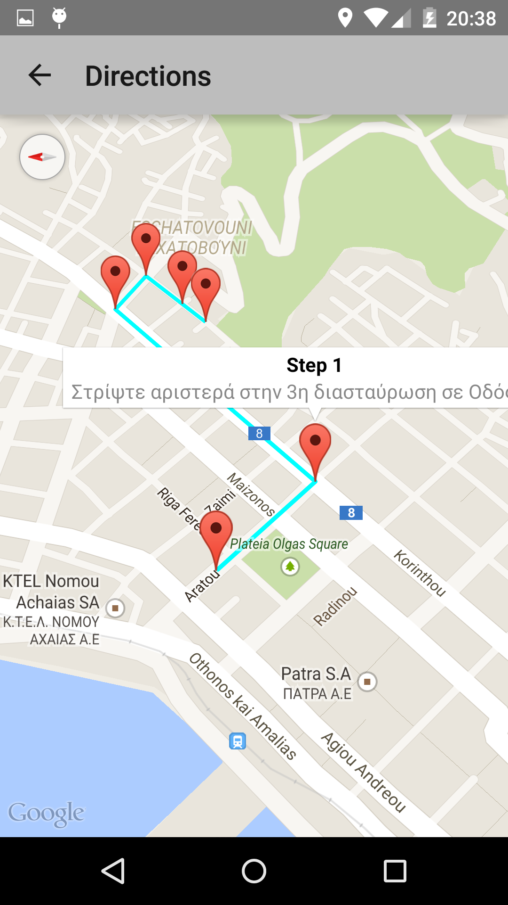
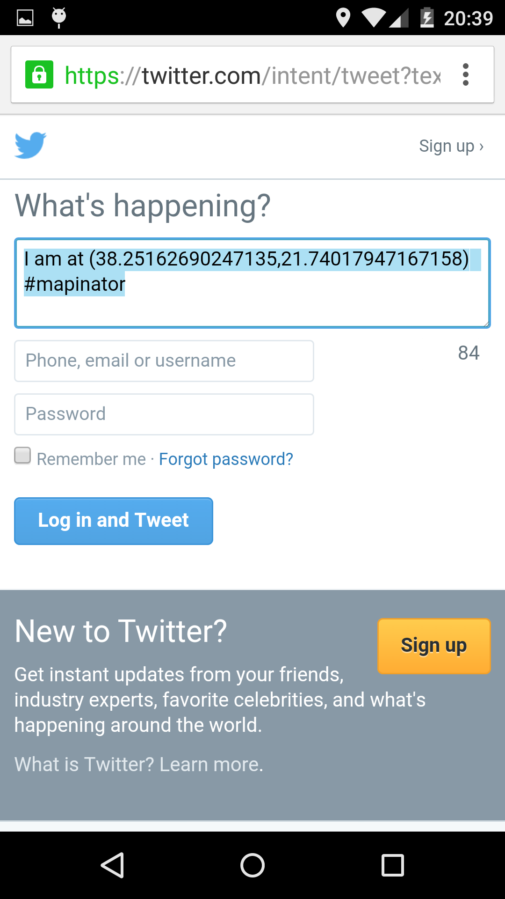

# Mapinator

An Android mobile app that takes advantage of multiple functions of the Google Maps API.

- OAuth based authentication with twitter.
- Users can save and edit markers for favourite locations, choose a destination, get directions and share their location through social media.

